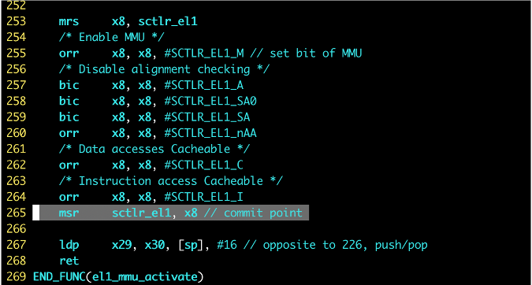
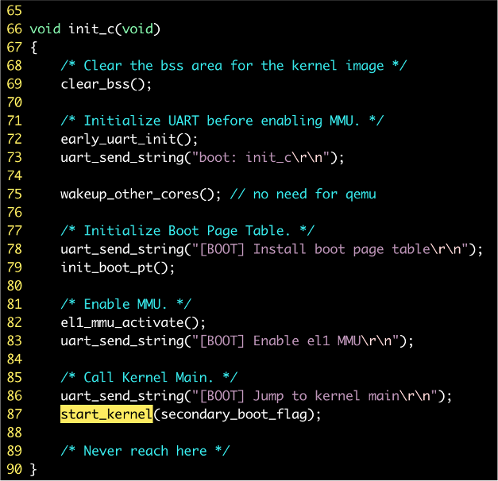
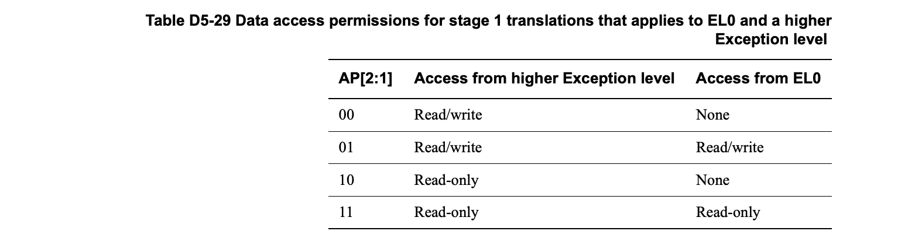

##Chcore Lab2 实验报告

### 519021910913 黄喆敏

> 思考题 1：请思考多级页表相比单级页表带来的优势和劣势（如果有的话），并计算在 AArch64 页表中分别以 4KB 粒度和 2MB 粒度映射 0～4GB 地址范围所需的物理内存大小（或页表页数量）。

答：多级页表的优势：单机页表中的每一项都需要存在，而多级页表允许在整个页表结构中出现空洞，因此可以根据需要部分创建，**极大地节约所占空间**；劣势：相比于单级页表，需要逐级寻址，速度较慢。

- 以4KB粒度映射，映射0~4GB地址需要$$\frac{4GB}{4KB \times 2^9}=2^{11}$$个L3页表，$$\frac{2^{11}}{2^9}=4$$个L2页表，1个L1页表和1个L0页表。因此页表页数量：$$2^{11}+4+1+1=2054$$个。
- 以2MB粒度映射，映射0~4GB地址需要$$\frac{4GB}{2MB \times 2^9}=4$$个L2页表，1个L1页表和1个L0页表。因此页表页数量：$$4+1+1=6$$个。


> 练习题 2：请在 `init_boot_pt` 函数的 `LAB 2 TODO 1` 处配置内核高地址页表（`boot_ttbr1_l0`、`boot_ttbr1_l1` 和 `boot_ttbr1_l2`），以 2MB 粒度映射。

答：与配置内核低地址页表类似，需要注意首地址不同。

```c
/* Step 1: set L0 and L1 page table entry */
vaddr = PHYSMEM_START;
boot_ttbr1_l0[GET_L0_INDEX(vaddr + KERNEL_VADDR)] =
        ((u64)boot_ttbr1_l1) | IS_TABLE | IS_VALID | NG;
boot_ttbr1_l1[GET_L1_INDEX(vaddr + KERNEL_VADDR)] =
        ((u64)boot_ttbr1_l2) | IS_TABLE | IS_VALID | NG;

/* Step 2: map PHYSMEM_START ~ PERIPHERAL_BASE with 2MB granularity */
for (; vaddr < PERIPHERAL_BASE; vaddr += SIZE_2M) {
        boot_ttbr1_l2[GET_L2_INDEX(vaddr + KERNEL_VADDR)] =
                (vaddr) /* low mem, va = pa */
                | UXN /* Unprivileged execute never */
                | ACCESSED /* Set access flag */
                | NG /* Mark as not global */
                | INNER_SHARABLE /* Sharebility */
                | NORMAL_MEMORY /* Normal memory */
                | IS_VALID;
}

/* Step 3: map PERIPHERAL_BASE ~ PHYSMEM_END with 2MB granularity */
for (vaddr = PERIPHERAL_BASE; vaddr < PHYSMEM_END; vaddr += SIZE_2M) {
        boot_ttbr1_l2[GET_L2_INDEX(vaddr + KERNEL_VADDR)] =
                (vaddr) /* low mem, va = pa */
                | UXN /* Unprivileged execute never */
                | ACCESSED /* Set access flag */
                | NG /* Mark as not global */
                | DEVICE_MEMORY /* Device memory */
                | IS_VALID;
}
```

> 思考题 3：请思考在 `init_boot_pt `函数中为什么还要为低地址配置⻚表，并尝试验证自己的解释。`

答：





可以看到，在第267行，需要得到pc与sp的物理地址。而此时刚刚开启了MMU，**pc与sp没有切换到高地址，还指向低地址**。因此，在`init_boot_pt`函数中，需要为低地址配置页表，使得指令能正常执行。


> 练习题 4：完成 `kernel/mm/buddy.c` 中的 `split_page`、`buddy_get_pages`、`merge_page` 和 `buddy_free_pages` 函数中的 `LAB 2 TODO 2` 部分，其中 `buddy_get_pages` 用于分配指定阶大小的连续物理页，`buddy_free_pages` 用于释放已分配的连续物理页。

答：`split_page`：我们采用递归的方法，若当前page已经被分配，或者当前page的阶不满足大小，直接返回；反之我们将当前的块分裂，并将buddy_page放入free_list中，标记为not allocated。

```c
static struct page *split_page(struct phys_mem_pool *pool, u64 order,
                               struct page *page)
{
        /* LAB 2 TODO 2 BEGIN */
        /*
         * Hint: Recursively put the buddy of current chunk into
         * a suitable free list.
         */
        if (page->allocated == 1 || page->order <= order) {
                page->allocated = 1;
                kdebug("split_page: directly return");
                return page;
        }
        page->order--;
        struct page *buddy_page = get_buddy_chunk(pool, page);
        if (buddy_page != NULL) {
                buddy_page->order = page->order;
                buddy_page->allocated = 0;
        }
        struct free_list *list = &pool->free_lists[page->order];
        list_add(&buddy_page->node, &list->free_list);
        list->nr_free++;

        return split_page(pool, order, page);

        /* LAB 2 TODO 2 END */
}
```

`buddy_get_pages`：若当前要求的order不在合法范围内，直接返回NULL。我们找到一个足够大的块，将这个块从free_list中删除，并调用`split_page`分割为所要的大小。最后我们将page设为allocated，返回page。

```c
struct page *buddy_get_pages(struct phys_mem_pool *pool, u64 order)
{
        /* LAB 2 TODO 2 BEGIN */
        /*
         * Hint: Find a chunk that satisfies the order requirement
         * in the free lists, then split it if necessary.
         */

        if (order >= BUDDY_MAX_ORDER || order < 0) {
                return NULL;
        }
        int now_order = order;
        while (now_order < BUDDY_MAX_ORDER
               && pool->free_lists[now_order].nr_free <= 0) {
                now_order++;
        }

        if (now_order >= BUDDY_MAX_ORDER) {
                kwarn("[buddy.c] buddy_get_pages: fail to require order\n");
                return NULL;
        }

        struct page *page = list_entry(
                pool->free_lists[now_order].free_list.next, struct page, node);
        pool->free_lists[now_order].nr_free--;
        list_del((struct list_head *)page);

        if (page == NULL) {
                kwarn("[buddy.c] buddy_get_pages: page is null\n");
                return NULL;
        }

        if (now_order > order) {
                page = split_page(pool, order, page);
        }
        page->allocated = 1; //统一在get_page时将allocated设为1,其他地方不改变
        return page;
        /* LAB 2 TODO 2 END */
}
```

`merge_page`：首先判断page与buddy page是否符合条件。两者均不为空，且都没有allocated，阶数相同，才能进行合并。接着我们将page与buddy page从所属的free_list中删除，递归地向上合并。

此处需要注意，**我们需要选择小地址的块继续向上合并**。因此当page（合并块）的地址比buddy page地址大时，需要将两者交换。

```c
static struct page *merge_page(struct phys_mem_pool *pool, struct page *page)
{
        /* LAB 2 TODO 2 BEGIN */
        /*
         * Hint: Recursively merge current chunk with its buddy
         * if possible.
         */
        if (page == NULL || page->allocated == 1
            || page->order >= BUDDY_MAX_ORDER - 1) {
                kdebug("merge_page: no page, directly return\n");
                return page;
        }

        struct page *buddy_page = get_buddy_chunk(pool, page);

        if (buddy_page == NULL || buddy_page->order != page->order
            || buddy_page->allocated == 1) {
                kdebug("merge_page: no buddy page, directly return\n");
                return page;
        }

        pool->free_lists[page->order].nr_free -= 2; //先将page与buddy page移除free list
        list_del(&page->node);
        list_del(&buddy_page->node);

        if (page > buddy_page) { //保证page比buddy_page小
                struct page *tmp = page;
                page = buddy_page;
                buddy_page = tmp;
        }

        page->order++;
        //然后把merge一次的page再加回free list
        struct free_list *list = &pool->free_lists[page->order]; 
        list->nr_free++;
        list_add(&page->node, &list->free_list);

        return merge_page(pool, page); 
}
```

`buddy_free_pages`：我们将当前page的allocated设为0，加入free_list中，之后调用`merge_page`，递归向上合并即可。

```c
void buddy_free_pages(struct phys_mem_pool *pool, struct page *page)
{
        /* LAB 2 TODO 2 BEGIN */
        /*
         * Hint: Merge the chunk with its buddy and put it into
         * a suitable free list.
         */
        if (page->allocated == 0) { //当前为空闲页,可能出错
                kwarn("[buddy.c] buddy_free_pages: page->allocated = 0, return");
                return;
        }

        page->allocated = 0;
        struct free_list *list = &pool->free_lists[page->order];
        list->nr_free++;
        list_add(&page->node, &list->free_list);

        merge_page(pool, page);
        /* LAB 2 TODO 2 END */
}
```


> 练习题 5：完成 `kernel/arch/aarch64/mm/page_table.c` 中的 `query_in_pgtbl`、`map_range_in_pgtbl`、`unmap_range_in_pgtbl` 函数中的 `LAB 2 TODO 3` 部分，分别实现页表查询、映射、取消映射操作。
>
> 练习题 6：在上一个练习的函数中支持大页（2M、1G 页）映射，可假设取消映射的地址范围一定是某次映射的完整地址范围，即不会先映射一大块，再取消映射其中一小块。

答：`query_in_pgtbl`:  我们利用所给的`get_next_ptp`函数获取pte。当`ret=NORMAL_PTP`时，我们遍历到下一级页表。反之，我们判断根据当前页的level，使用对应的函数将虚拟地址转换为物理地址。当`ret<0`时，说明是没有映射的情况，返回`-ENOMAPPING`即可。

```c
int query_in_pgtbl(void *pgtbl, vaddr_t va, paddr_t *pa, pte_t **entry)
{
        /* LAB 2 TODO 3 BEGIN */
        /*
         * Hint: Walk through each level of page table using `get_next_ptp`,
         * return the pa and pte until a L0/L1 block or page, return
         * `-ENOMAPPING` if the va is not mapped.
         */

        ptp_t *ptp = (ptp_t *)pgtbl;
        int ret = 0;
        u32 level = 0;
        ptp_t *next_ptp = NULL;
        pte_t *next_pte = NULL;

        while (true) {
                ret = get_next_ptp(
                        ptp, level, va, &next_ptp, &next_pte, false);
                if (ret < 0) {
                        break;
                }
                if (level < 3 && ret == NORMAL_PTP) {
                        ptp = next_ptp;
                } else {
                        u64 tmp = 0;
                        switch (level) {
                        case 1:
                                tmp = GET_VA_OFFSET_L1(va);
                                break;
                        case 2:
                                tmp = GET_VA_OFFSET_L2(va);
                                break;
                        case 3:
                                tmp = GET_VA_OFFSET_L3(va);
                                break;
                        }
                        *pa = virt_to_phys((vaddr_t)next_ptp) + tmp;
                        *entry = next_pte;
                        break;
                }
                level++;
        }
        if (ret < 0) {
                return ret;
        }
        return 0;
        /* LAB 2 TODO 3 END */
}
```

`map_range_in_pgtbl_huge`：我们直接分析大页的情况。分配页时，我们尽可能分配较大的页。若`len>1GB`，我们优先分配1GB大页。与之类似，若剩下的`len>2MB`，我们分配2MB大页，反之分配4KB页。

以分配1GB大页为例。我们使用`get_next_ptp`得到pte。设置对应的页的属性，使用`set_pte_flags`设置标志位。循环分配接下来的页即可。

```c
int map_range_in_pgtbl_huge(void *pgtbl, vaddr_t va, paddr_t pa, size_t len,
                            vmr_prop_t flags)
{
        /* LAB 2 TODO 4 BEGIN */
        //分别映射1g, 2m, 4k
        size_t upper = len / SIZE_1G;
        len %= SIZE_1G;

        for (size_t i = 0; i < upper; i++, va += SIZE_1G, pa += SIZE_1G) {
                ptp_t *ptp = (ptp_t *)pgtbl;
                int ret = 0;
                u32 level = 0;
                ptp_t *next_ptp = NULL;
                pte_t *next_pte = NULL;
                ret = get_next_ptp(ptp, level, va, &next_ptp, &next_pte, true);
                if (ret < 0) {
                        return ret;
                }

                pte_t tmp;
                tmp.pte = 0;
                tmp.l1_block.is_table = 0;
                tmp.l1_block.is_valid = 1;
                set_pte_flags(&tmp, flags, USER_PTE);
                tmp.l1_block.pfn = pa >> SHIFT_1G;

                int idx = GET_L1_INDEX(va);
                next_ptp->ent[idx].pte = tmp.pte;
        }

        upper = len / SIZE_2M;
        len %= SIZE_2M;

        for (size_t i = 0; i < upper; i++, va += SIZE_2M, pa += SIZE_2M) {
                ptp_t *ptp = (ptp_t *)pgtbl;
                int ret = 0;
                u32 level = 0;
                ptp_t *next_ptp = NULL;
                pte_t *next_pte = NULL;

                while (true) {
                        ret = get_next_ptp(ptp, level, va, &next_ptp, &next_pte, true);
                        if (ret < 0) {
                                break;
                        }
                        if (level < 1) {
                                ptp = next_ptp;
                        } else {
                                pte_t tmp;
                                tmp.pte = 0;
                                tmp.l2_block.is_valid = 1;
                                tmp.l2_block.is_table = 0;
                                set_pte_flags(&tmp, flags, USER_PTE);
                                tmp.l2_block.pfn = pa >> SHIFT_2M;

                                int idx = GET_L2_INDEX(va);
                                next_ptp->ent[idx].pte = tmp.pte;
                                break;
                        }
                        level++;
                }
        }

        upper = (len + PAGE_SIZE - 1) / PAGE_SIZE;
        for (size_t i = 0; i < upper; i++, va += PAGE_SIZE, pa += PAGE_SIZE) {
                ptp_t *ptp = (ptp_t *)pgtbl;
                int ret = 0;
                u32 level = 0;
                ptp_t *next_ptp = NULL;
                pte_t *next_pte = NULL;

                while (true) {
                        ret = get_next_ptp(ptp, level, va, &next_ptp, &next_pte, true);
                        if (ret < 0) {
                                break;
                        }
                        if (level < 2) {
                                ptp = next_ptp;
                        } else {
                                pte_t tmp;
                                tmp.pte = 0;
                                tmp.l3_page.is_page = 1;
                                tmp.l3_page.is_valid = 1;
                                set_pte_flags(&tmp, flags, USER_PTE);
                                tmp.l3_page.pfn = pa >> PAGE_SHIFT;

                                int idx = GET_L3_INDEX(va);
                                next_ptp->ent[idx].pte = tmp.pte;
                                break;
                        }
                        level++;
                }
        }
        return 0;
        /* LAB 2 TODO 4 END */
}
```

`unmap_range_in_pgtbl_huge`：`unmap`的过程与`map`相类似。我们依次对1G页，2M页，4K页进行unmap操作，再设置页表标志位即可。

```c
int unmap_range_in_pgtbl_huge(void *pgtbl, vaddr_t va, size_t len)
{
        /* LAB 2 TODO 4 BEGIN */
        size_t upper = len / SIZE_1G;
        len %= SIZE_1G;
        for (size_t i = 0; i < upper; i++, va+=SIZE_1G) {
                ptp_t *ptp = (ptp_t *)pgtbl;
                int ret = 0;
                u32 level = 0;
                ptp_t *next_ptp = NULL;
                pte_t *next_pte = NULL;

                ret = get_next_ptp(ptp, level, va, &next_ptp, &next_pte, false);
                if (ret >= 0) {
                        int idx = GET_L1_INDEX(va);
                        next_ptp->ent[idx].pte = 0;
                        next_ptp->ent[idx].l1_block.is_valid = 0;
                        next_ptp->ent[idx].l1_block.is_table = 1;
                } else {
                        return ret;
                }
        }

        upper = len / SIZE_2M;
        len %= SIZE_2M;
        for (size_t i = 0; i < upper; i++, va+=SIZE_2M) {
                ptp_t *ptp = (ptp_t *)pgtbl;
                int ret = 0;
                u32 level = 0;
                ptp_t *next_ptp = NULL;
                pte_t *next_pte = NULL;

                while (true) {
                        ret = get_next_ptp(ptp, level, va, &next_ptp, &next_pte, false);
                        if (ret < 0) {
                                break;
                        }
                        if (level < 1) {
                                ptp = next_ptp;
                        } else {
                                int idx = GET_L2_INDEX(va);
                                next_ptp->ent[idx].pte = 0;
                                next_ptp->ent[idx].l2_block.is_table = 1;
                                next_ptp->ent[idx].l2_block.is_valid = 0;
                                break;
                        }
                        level++;
                }
                if (ret < 0) {
                        return ret;
                }
        }

        upper = (len + PAGE_SIZE - 1) / PAGE_SIZE;
        for (size_t i = 0; i < upper; i++, va += PAGE_SIZE) {
                ptp_t *ptp = (ptp_t *)pgtbl;
                int ret = 0;
                u32 level = 0;
                ptp_t *next_ptp = NULL;
                pte_t *next_pte = NULL;

                while (true) {
                        ret = get_next_ptp(ptp, level, va, &next_ptp, &next_pte, false);
                        if (ret < 0) {
                                break;
                        }
                        if (level < 2) {
                                ptp = next_ptp;
                        } else {
                                int idx= GET_L3_INDEX(va);
                                next_ptp->ent[idx].pte = 0;
                                next_ptp->ent[idx].l3_page.is_valid=0;
                                break;
                        }
                        level++;
                }
                if (ret < 0) {
                        return ret;
                }
        }

        return 0;
        /* LAB 2 TODO 4 END */
}
```


> 思考题 7：阅读 Arm Architecture Reference Manual，思考要在操作系统中支持写时拷贝（Copy-on-Write，CoW）需要配置页表描述符的哪个/哪些字段，并在发生缺页异常（实际上是 permission fault）时如何处理。

答：

支持写时拷贝，需要配置页表描述符的**AP(access permission)字段为read-only**，即将页表条目标记为只读。

发生缺页异常时，会在物理内存中创建一个该页面的新副本，并将页表条目映射到这个新副本；配置新页面对应的AP字段，恢复这个页面的可写权限。


> 思考题 8：为了简单起见，在 ChCore 实验中没有为内核页表使用细粒度的映射，而是直接沿用了启动时的粗粒度页表，请思考这样做有什么问题。

答：粗粒度页表会占用更大的内存空间，容易造成内存浪费，可能会产生更多的内部碎片。因此最好对内核页表重新进行细粒度的映射。

### Reference

[1] Arm Architecture Reference Manual D5.4

[2] CS:APP 9.8 Memory Mapping
