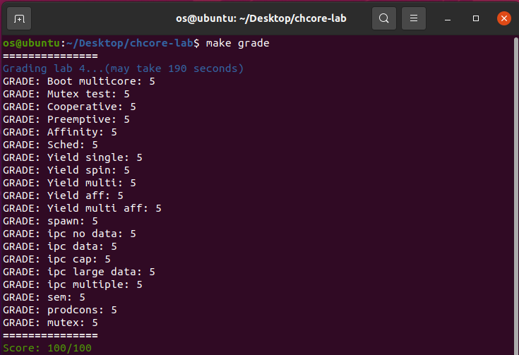

##Chcore Lab4 实验报告

### 519021910913 黄喆敏

> **思考题 1：**阅读汇编代码`kernel/arch/aarch64/boot/raspi3/init/start.S`。说明ChCore是如何选定主CPU，并阻塞其他CPU的执行的。

答：

- **选定主CPU：**我们观察`start.S`里的`_start`函数，可以看到，当前的cpu_id存放在x8寄存器中。程序读取`mpidr_el1`的后8位，若为0，则是主CPU，跳转到`primary`，否则进入`wait_for_bss_clear`。

  ```assembly
  mrs    x8, mpidr_el1
  and    x8, x8, #0xFF
  cbz    x8, primary
  ```

- **阻碍其他CPU的执行**：对于其他CPU，首先会进入`wait_for_bss_clear`，若`clear_bss_flag!=0`，代表bss段尚未清空，继续等待。

  bss段清空后，更改为`el1`异常级别，并设置栈，进入`wait_until_smp_enabled`。

  ```assembly
  adr    x0, clear_bss_flag
  ldr    x1, [x0]
  cmp     x1, #0
  bne    wait_for_bss_clear
  
  /* Turn to el1 from other exception levels. */
  bl     arm64_elX_to_el1
  
  /* Prepare stack pointer and jump to C. */
  mov    x1, #INIT_STACK_SIZE
  mul    x1, x8, x1
  ldr    x0, =boot_cpu_stack
  add    x0, x0, x1
  add    x0, x0, #INIT_STACK_SIZE
  mov    sp, x0
  ```

- 进入`wait_until_smp_enabled`后，程序会持续阻塞，直到当前核所在的`secondary_boot_flag`被设为1。主CPU会通过`enable_smp_cores`，设置其他CPU的`secondary_boot_flag`，激活其他CPU。

  ```assembly
  mov    x1, #8
  mul    x2, x8, x1
  ldr    x1, =secondary_boot_flag
  add    x1, x1, x2
  ldr    x3, [x1]
  cbz    x3, wait_until_smp_enabled
  
  /* Set CPU id */
  mov    x0, x8
  bl     secondary_init_c
  ```


> **思考题2：**阅读汇编代码`kernel/arch/aarch64/boot/raspi3/init/start.S, init_c.c`以及`kernel/arch/aarch64/main.c`，解释用于阻塞其他CPU核心的`secondary_boot_flag`是物理地址还是虚拟地址？是如何传入函数`enable_smp_cores`中，又该如何赋值的（考虑虚拟地址/物理地址）？

答：

- `boot_flag`是物理地址，而`secondary_boot_flag`为`boot_flag`转换得到的虚拟地址。

- 在`kernel/arch/aarch64/head.S`中，`start_kernel`会将地址空间从低地址转到高地址。`x0`存储的是`boot_flag`的值，会作为第一个参数传递给`main`。`main`接着将`boot_flag`作为参数传递给`enable_smp_cores`。

  ```c
  /* Args in x0 (boot_flag) should be passed to main */
  BEGIN_FUNC(start_kernel)
  		......
      /* Restore x0 */
      ldr     x0, [sp], #8
  
      bl      main
  END_FUNC(start_kernel)
    
  void main(paddr_t boot_flag)
  {
    			......
          /* Other cores are busy looping on the addr, wake up those cores */
          enable_smp_cores(boot_flag);
          kinfo("[ChCore] boot multicore finished\n");
    			......
  }
  ```

- 在给`secondary_boot_flag`赋值时，由于传递过程中均为物理地址，且此时已经开启了MMU，因此需要将**物理地址转换为虚拟地址**。之后对于每一个CPU核，完成初始化后，设置下一个核的`secondary_boot_flag`为1。

  ```c
   /* Set current cpu status */
  cpu_status[smp_get_cpu_id()] = cpu_run;
  secondary_boot_flag = (long *)phys_to_virt(boot_flag);
  for (i = 0; i < PLAT_CPU_NUM; i++) {
          /* LAB 4 TODO BEGIN */
          *(secondary_boot_flag + i) = 1;
          /* LAB 4 TODO END */
  }
  ```

  

> **练习3：**完善主CPU激活各个其他CPU的函数：`enable_smp_cores`和`kernel/arch/aarch64/main.c`中的`secondary_start`。请注意测试代码会要求各个其他CPU按序被依次激活。

答：

- `enable_smp_cores`：我们将当前需要启动的CPU核对应的`secondary_boot_flag`设为1，等到当前核启动完毕后，设置`cpu_status[i]=cpu_run`，再启动下一个。

  ```c
  void enable_smp_cores(paddr_t boot_flag)
  {
  		int i = 0;
  		long *secondary_boot_flag;   
     /* Set current cpu status */
      cpu_status[smp_get_cpu_id()] = cpu_run;
      secondary_boot_flag = (long *)phys_to_virt(boot_flag);
      for (i = 0; i < PLAT_CPU_NUM; i++) {
              /* LAB 4 TODO BEGIN */
              *(secondary_boot_flag + i) = 1;
              /* LAB 4 TODO END */
        			......
              /* LAB 4 TODO BEGIN */
              while (cpu_status[i] != cpu_run) {
              }
              /* LAB 4 TODO END */
              if (cpu_status[i] == cpu_run)
                      kinfo("CPU %d is active\n", i);
              else
                      BUG("CPU %d not running!\n", i);
      }
      /* wait all cpu to boot */
      kinfo("All %d CPUs are active\n", PLAT_CPU_NUM);
      init_ipi_data();
  }
  ```

- `secondary_start`：当前核启动时，我们设置`cpu_status[cpuid]=cpu_run`。

  ```c
  void secondary_start(void)
  {
          u32 cpuid = smp_get_cpu_id();
  
          arch_interrupt_init_per_cpu();
          pmu_init();
  
          /* LAB 4 TODO BEGIN: Set the cpu_status */
          cpu_status[cpuid] = cpu_run;
          /* LAB 4 TODO END */
    			......
          lock_kernel();
          sched();
          eret_to_thread(switch_context());
  }
  ```

  

> **练习4：**本练习分为以下几个步骤：
>
> 1. 请熟悉排号锁的基本算法，并在`kernel/arch/aarch64/sync/ticket.c`中完成`unlock`和`is_locked`的代码。
> 2. 在`kernel/arch/aarch64/sync/ticket.c`中实现`kernel_lock_init`、`lock_kernel`和`unlock_kernel`。
> 3. 在适当的位置调用`lock_kernel`。
> 4. 判断什么时候需要放锁，添加`unlock_kernel`。

答：

1. 根据排号锁的定义，放锁时将锁传递给下一个，若锁拥有者不是当前拿到的号，就没有锁住。

```c
void unlock(struct lock *l)
{
        struct lock_impl *lock = (struct lock_impl *)l;

        BUG_ON(!lock);
        smp_mb(); /* load, store -> store barrier may use stlr here */
        /* LAB 4: set the correct lock->owner */
        /* LAB 4 TODO BEGIN */
        lock->owner++;
        /* LAB 4 TODO END */
}

int is_locked(struct lock *l)
{
        int ret = 0;
        struct lock_impl *lock = (struct lock_impl *)l;
        /* LAB 4 TODO BEGIN */
        ret = lock->owner != lock->next;
        /* LAB 4 TODO END */
        return ret;
}
```

2. 直接调用`lock_init`，`lock`，`unlock`几个接口即可。

```c
void kernel_lock_init(void)
{
        u32 ret = 0;

        /* LAB 4 TODO BEGIN */
        ret = lock_init(&big_kernel_lock);
        /* LAB 4 TODO END */
        BUG_ON(ret != 0);
}

void lock_kernel(void)
{
        /* LAB 4 TODO BEGIN */
        lock(&big_kernel_lock);
        /* LAB 4 TODO END */
}

void unlock_kernel(void)
{
        BUG_ON(!is_locked(&big_kernel_lock));
        /* LAB 4 TODO BEGIN */
        unlock(&big_kernel_lock);
        /* LAB 4 TODO END */
}
```

3. 需要添加`lock_kernel`的地方：`el0_syscall`，`handle_entry_c`，`handle_irq`。

- 对于`el0_syscall`，我们直接添加跳转到`lock_kernel`的汇编指令即可。

  ```assembly
  el0_syscall:
  			 ......
         /* LAB 4 TODO BEGIN */
          bl lock_kernel
         /* LAB 4 TODO END */
         ......
         exception_exit
  ```

- 对于`handle_entry_c`，如果异常在内核中捕获，则不应获取大内核锁。我们通过`type`来判断异常的位置。从`irq_entry.h`中可得知，当`0<=type<SYNC_EL0_64`时，为`EL1`级别异常；当`type>=SYNC_EL0_64`时，为`EL0`级别异常。

  ```c
  void handle_entry_c(int type, u64 esr, u64 address)
  {
          /* Acquire the big kernel lock, if the exception is not from kernel */
          /* LAB 4 TODO BEGIN */
          if (type >= SYNC_EL0_64) {
                  lock_kernel();
          }
          /* LAB 4 TODO END */
          ......
  }
  ```

- 对于`handle_irq`，根据语义，**如果不是内核异常，或被中断的线程是空闲线程**，应该获取大内核锁。

  ```c
  /* Interrupt handler for interrupts happening when in EL0. */
  void handle_irq(int type)
  {
    			......
          if (type >= SYNC_EL0_64
              || current_thread->thread_ctx->type == TYPE_IDLE) {
                  /* LAB 4 TODO BEGIN */
                  lock_kernel();
                  /* LAB 4 TODO END */
          }
          plat_handle_irq();
          sched();
          eret_to_thread(switch_context());
  }
  ```

4. 需要添加`unlock_kernel`的地方：`sync_el0_64`，`el0_syscall`，`__eret_to_thread`。即在使用`exception_exit`的地方前释放锁即可。注意在有些异常下，不需要释放锁。

- `sync_el0_64`：

  ```assembly
  sync_el0_64:
  			 ......
         /* Not supported exception */
         mov    x0, SYNC_EL0_64
         mrs    x1, esr_el1
         mrs    x2, elr_el1
         bl     handle_entry_c
  
          bl      unlock_kernel
         exception_exit
  ```

- `el0_syscall`：

  ```assembly
  el0_syscall:
  			 ......
         /* Ret from syscall */
         str    x0, [sp]
  
         bl      unlock_kernel
         exception_exit
  ```

- `__eret_to_thread`：

  ```assembly
  /* void eret_to_thread(u64 sp) */
  BEGIN_FUNC(__eret_to_thread)
         mov    sp, x0
         dmb ish
  
         bl      unlock_kernel
         exception_exit
  END_FUNC(__eret_to_thread)
  ```


> **思考题5：**在`el0_syscall`调用`lock_kernel`时，在栈上保存了寄存器的值。这是为了避免调用`lock_kernel`时修改这些寄存器。在`unlock_kernel`时，是否需要将寄存器的值保存到栈中，试分析其原因。

答：不需要。因为在调用`lock_kernel`时保存寄存器的值，是为了防止执行`lock_kernel`时修改寄存器；而在`unlock_kernel`后，会立即执行`exception_exit`，从内核栈中恢复用户态的寄存器，因此没有必要在`unlock_kernel`时保存寄存器的值。


> **思考题6：**为何`idle_threads`不会加入到等待队列中？请分析其原因？

答：空闲进程的目的是为了避免CPU核心在没有要调度的线程时，在内核态忙等，并不会进行有实际意义的操作。我们并没有必要将其加入到等待队列中，进行调度。


> **练习7：**完善`kernel/sched/policy_rr.c`中的调度功能，包括`rr_sched_enqueue`，`rr_sched_dequeue`， `rr_sched_choose_thread`与`rr_sched`，需要填写的代码使用`LAB 4 TODO BEGIN`标出。在完成该部分后应能看到如下输出，并通过`cooperative`测试获得5分。

答：

- `rr_sched_enqueue`：我们需要对许多参数进行判断。当线程状态为`TS_READY`时，线程已经放入合适的队列，返回报错；对于空闲进程，直接返回。进行完这些判断后，我们将线程插入就绪队列，并设置线程的状态为`TS_READY`。

  ```c
  int rr_sched_enqueue(struct thread *thread)
  {
          /* LAB 4 TODO BEGIN */
          if (!(thread && thread->thread_ctx
                && thread->thread_ctx->state != TS_READY)) {
                  return -1;
          }
          if (thread->thread_ctx->type == TYPE_IDLE) {
                  return 0;
          }
          list_append(
                  &thread->ready_queue_node,
                  &(rr_ready_queue_meta[thread->thread_ctx->cpuid].queue_head));
          thread->thread_ctx->state = TS_READY;
          /* LAB 4 TODO END */
          return 0;
  }
  ```

- `rr_sched_dequeue`：首先是一系列参数检查。如果线程为空/线程为空闲进程/线程状态不正确/就绪队列为空，直接返回报错。接着将线程状态设置为`TS_INTER`，更新`thread_ctx->cpuid`，将线程取出就绪队列。

  ```c
  int rr_sched_dequeue(struct thread *thread)
  {
          /* LAB 4 TODO BEGIN */
          if (thread == NULL || thread->thread_ctx == NULL
              || thread->thread_ctx->type == TYPE_IDLE
              || thread->thread_ctx->state != TS_READY
              || list_empty(
                      &thread->ready_queue_node))
          {
                  return -1;
          }
          thread->thread_ctx->state = TS_INTER;
          thread->thread_ctx->cpuid = smp_get_cpu_id(); 
          list_del(&thread->ready_queue_node);
          /* LAB 4 TODO END */
          return 0;
  }
  ```

- `rr_sched_choose_thread`：如果CPU核心的就绪队列为空，我们返回当前CPU核心的空闲线程；否则我们调用`list_entry`，找到下一个就绪的线程，并出队。

  ```c
  struct thread *rr_sched_choose_thread(void)
  {
          struct thread *thread = NULL;
          /* LAB 4 TODO BEGIN */
          int cpu_id = smp_get_cpu_id();
          struct list_head *head = &(rr_ready_queue_meta[cpu_id].queue_head);
          if (list_empty(head)) {
                  thread = &idle_threads[cpu_id];
          } else {
                  thread = list_entry(head->next, struct thread, ready_queue_node);
                  if (rr_sched_dequeue(thread) != 0) {
                          return NULL; // TODO: check
                  }
          }
          /* LAB 4 TODO END */
          return thread;
  }
  ```

- `rr_sched`：将当前线程插入就绪队列，并选择一个进程调度，进行上下文切换。注意waiting thread不能入队，并且当`thread_exit_state`为`TE_EXITING`时，需要更新线程的state为`TS_EXIT`，`thread_exit_state`为`TE_EXITED`。

  ```c
  int rr_sched(void)
  {
          /* LAB 4 TODO BEGIN */
          if (current_thread == NULL || current_thread->thread_ctx == NULL
              || current_thread->thread_ctx->sc == NULL) {
                  struct thread *thread = rr_sched_choose_thread();
                  switch_to_thread(thread);
                  return 0;
          }
  
          if (current_thread->thread_ctx->thread_exit_state == TE_EXITING) {
                  current_thread->thread_ctx->thread_exit_state = TE_EXITED;
                  current_thread->thread_ctx->state = TS_EXIT;
          }
  
          // waiting thread cannot enqueue
          if (current_thread->thread_ctx->type != TYPE_IDLE
              && current_thread->thread_ctx->state != TS_WAITING) {
                  sched_enqueue(current_thread);
          }
          struct thread *thread = rr_sched_choose_thread();
          switch_to_thread(thread);
          /* LAB 4 TODO END */
          return 0;
  }
  ```

  

> **思考题8：**如果异常是从内核态捕获的，CPU核心不会在`kernel/arch/aarch64/irq/irq_entry.c`的`handle_irq`中获得大内核锁。但是，有一种特殊情况，即如果空闲线程（以内核态运行）中捕获了错误，则CPU核心还应该获取大内核锁。否则，内核可能会被永远阻塞。请思考一下原因。

答：当空闲线程捕获错误时，触发异常，会进入`handle_irq`，此时会触发一次调度，即调用 `eret_to_thread(switch_context())`，释放大内核锁。如果之前CPU核心没有拿锁的话，此时空闲进程**没有拿锁但是放锁**，会导致其他线程永远拿不到大内核锁，内核被阻塞。


> **练习9：**在`kernel/sched/sched.c`中实现系统调用`sys_yield()`，使用户态程序可以启动线程调度。此外，ChCore还添加了一个新的系统调用`sys_get_cpu_id`，其将返回当前线程运行的CPU的核心id。请在`kernel/syscall/syscall.c`文件中实现该函数。

答：

- `sys_yield`：调度到其他线程。

  ```c
  void sys_yield(void)
  {
          /* LAB 4 TODO BEGIN */
          sched();
          eret_to_thread(switch_context());
          /* LAB 4 TODO END */
          BUG("Should not return!\n");
  }
  ```

- `sys_get_cpu_id`：我们调用`kernel/arch/aarch64/machine/smp.c`中提供的`smp_get_cpu_id`函数，获取当前线程运行的CPU的核心id。

  ```c
  /* Get cpu id */
  u32 sys_get_cpu_id()
  {
          u32 cpuid = 0;
          /* LAB 4 TODO BEGIN */
          cpuid = smp_get_cpu_id();
          /* LAB 4 TODO END */
          return cpuid;
  }
  ```

  

> **练习10：**定时器中断初始化的相关代码已包含在本实验的初始代码中（`timer_init`）。请在主CPU以及其他CPU的初始化流程中加入对该函数的调用。此时，`yield_spin.bin`应可以正常工作：主线程应能在一定时间后重新获得对CPU核心的控制并正常终止。

答：主CPU以及其他CPU的初始化流程分别在`kernel/arch/aarch64/main.c`的`main`和`secondary_start`中进行，我们分别加入对`timer_init`的调用。

```c
void main(paddr_t boot_flag)
{
				......
        /* Init exception vector */
        arch_interrupt_init();
        /* LAB 4 TODO BEGIN */
        timer_init();
        /* LAB 4 TODO END */
  			......
}

void secondary_start(void)
{
        ......
        /* LAB 4 TODO BEGIN */
        timer_init();
        /* LAB 4 TODO END */
        lock_kernel();
        sched();
        eret_to_thread(switch_context());
}
```


>  **练习11：**在`kernel/sched/sched.c`处理时钟中断的函数`sched_handle_timer_irq`中添加相应的代码，以便它可以支持预算机制。更新其他调度函数支持预算机制，不要忘记在`kernel/sched/sched.c`的`sys_yield()`中重置“预算”，确保`sys_yield`在被调用后可以立即调度当前线程。完成本练习后应能够`tst_sched_preemptive`测试并获得5分。

答：

- `sched_handle_timer_irq`：每次处理时钟中断时，将当前线程的预算减少1。注意前面要加入一系列判断。

  ```c
  void sched_handle_timer_irq(void)
  {
          /* LAB 4 TODO BEGIN */
          if (current_thread == NULL || current_thread->thread_ctx == NULL
              || current_thread->thread_ctx->sc == NULL) {
                  return;
          }
          if (current_thread->thread_ctx->sc->budget > 0) {
                  current_thread->thread_ctx->sc->budget--;
          }
          /* LAB 4 TODO END */
  }
  ```

- `sys_yield`：在协作式调度的基础上，增加重置预算。

  ```c
  void sys_yield(void)
  {
          /* LAB 4 TODO BEGIN */
          if (current_thread && current_thread->thread_ctx
              && current_thread->thread_ctx->sc) {
                  current_thread->thread_ctx->sc->budget = 0;
          }
          sched();
          eret_to_thread(switch_context());
          /* LAB 4 TODO END */
          BUG("Should not return!\n");
  }
  ```

- `rr_sched_refill_budget`：给当前线程重新填满预算。

  ```c
  static inline void rr_sched_refill_budget(struct thread *target, u32 budget)
  {
          /* LAB 4 TODO BEGIN */
          target->thread_ctx->sc->budget = budget;
          /* LAB 4 TODO END */
  }
  ```

- `rr_sched`：在协作式调度的基础上，如果当前budget还有剩余，直接返回；否则调用 `rr_sched_refill_budget`，给当前线程重新填满默认预算，并调度线程。

  ```c
  int rr_sched(void)
  {
          /* LAB 4 TODO BEGIN */
          ......
          if (current_thread->thread_ctx->sc->budget != 0) {
                  return -1;
          }
          ......
          rr_sched_refill_budget(current_thread, DEFAULT_BUDGET);
          struct thread *thread = rr_sched_choose_thread();
          switch_to_thread(thread);
          /* LAB 4 TODO END */
          return 0;
  }
  ```


>  **练习12：**在`kernel/object/thread.c`中实现`sys_set_affinity`和`sys_get_affinity`。完善`kernel/sched/policy_rr.c`中的调度功能，增加线程的亲和性支持（如入队时检查亲和度等，请自行考虑）

答：

- `sys_set_affinity`与`sys_get_affinity`如下：

  ```c
  int sys_set_affinity(u64 thread_cap, s32 aff)
  {
  				......
          /* LAB 4 TODO BEGIN */
          thread->thread_ctx->affinity = aff;
          /* LAB 4 TODO END */
          ......
  }
  
  s32 sys_get_affinity(u64 thread_cap)
  {
          ......
          /* LAB 4 TODO BEGIN */
          aff = thread->thread_ctx->affinity;
          /* LAB 4 TODO END */
          ......
  }
  ```

- `rr_sched_enqueue`：当`affinity==NO_AFF`，表明没有亲和性要求，将当前的cpu_id赋给线程的cpuid；当`affinity`在合法区间时，将`affinity`赋给线程的cpuid；否则报错。

  ```c
  int rr_sched_enqueue(struct thread *thread)
  {
          /* LAB 4 TODO BEGIN */
          ......
          s32 affinity = thread->thread_ctx->affinity;
          if (affinity == NO_AFF) {
                  thread->thread_ctx->cpuid = smp_get_cpu_id();
          } else if (affinity >= 0 && affinity < PLAT_CPU_NUM) {
                  thread->thread_ctx->cpuid = affinity;
          } else {
                  return -1;
          }
          /* LAB 4 TODO END */
          return 0;
  }
  ```


> **练习13**：在`userland/servers/procm/launch.c`中填写`launch_process`函数中缺损的代码。

答：

- 为主线程的栈创建一个新的内存对象。

- 在`mem_layout_arch.h`中，我们可以得知主线程栈顶的虚拟地址；栈顶一块page_size的空间不能存放数据，因此offset设为`MAIN_THREAD_STACK_SIZE - PAGE_SIZE`。

- 根据文档，设置pmo的`cap`，`addr`，`perm`和`free_cap`。

- 设置栈顶指针的位置。

  ```c
  int launch_process(struct launch_process_args *lp_args)
  {
          /*
           * Lab4: create pmo for the stack of main thread stack in current
           * process.
           *  You do not need to modify code in this scope
           */
          /* LAB 4 TODO BEGIN: create pmo for main_stack_cap */
          main_stack_cap =
                  __chcore_sys_create_pmo(MAIN_THREAD_STACK_SIZE, PMO_DATA);
          /* LAB 4 TODO END */
          if (main_stack_cap < 0) {
                  printf("%s: fail to pmo_create (ret: %d)\n", __func__, ret);
                  goto fail;
          }
  
          /* LAB 4 TODO BEGIN: set stack_top and offset */
          stack_top = MAIN_THREAD_STACK_BASE + MAIN_THREAD_STACK_SIZE;
          offset = MAIN_THREAD_STACK_SIZE - PAGE_SIZE;
          /* LAB 4 TODO END */
    			......
          /* LAB 4 TODO BEGIN: fill pmo_map_requests */
          pmo_map_requests[0].pmo_cap = main_stack_cap;
          pmo_map_requests[0].addr = MAIN_THREAD_STACK_BASE;
          pmo_map_requests[0].perm = VM_READ | VM_WRITE;
          pmo_map_requests[0].free_cap = 1;
          /* LAB 4 TODO END */
    			......
          /* LAB 4 TODO BEGIN: set the stack for main thread */
          args.stack = MAIN_THREAD_STACK_BASE + MAIN_THREAD_STACK_SIZE - PAGE_SIZE;
          /* LAB 4 TODO END */
    			......
  }
  ```


> **练习14：**在`libchcore/src/ipc/ipc.c`与`kernel/ipc/connection.c`中实现了大多数IPC相关的代码，请根据注释完成其余代码。

答：主要根据文档以及注释细节实现。

- `ipc_register_server`：构造IPC服务所需要的参数`ipc_vm_config`。

  ```c
  int ipc_register_server(server_handler server_handler)
  {
          int ret = 0;
          struct ipc_vm_config vm_config;
          /* LAB 4 TODO BEGIN: fill vm_config */
          vm_config.stack_base_addr = SERVER_STACK_BASE;
          vm_config.stack_size = SERVER_STACK_SIZE;
          vm_config.buf_base_addr = SERVER_BUF_BASE;
          vm_config.buf_size = SERVER_BUF_SIZE;
          /* LAB 4 TODO END */
          ret = __chcore_sys_register_server(
                  (u64)server_handler, MAX_CLIENT, (u64)&vm_config);
          chcore_bug_on(ret < 0);
          return 0;
  }
  ```

- `ipc_register_client`：构造IPC客户端的参数`ipc_vm_config`。

  ```c
  struct ipc_struct *ipc_register_client(int server_thread_cap)
  {
  				......
          /* LAB 4 TODO BEGIN: fill vm_config according to client_id */
          vm_config.buf_base_addr =
                  CLIENT_BUF_BASE + client_id * CLIENT_BUF_SIZE; 
          vm_config.buf_size = CLIENT_BUF_SIZE;
          /* LAB 4 TODO END */
       		......
          return ipc_struct;
  }
  ```

- `ipc_set_msg_data`：在之前的共享内存中找到相应位置，然后拷贝需要传输的数据。

  ```c
  int ipc_set_msg_data(struct ipc_msg *ipc_msg, void *data, u64 offset, u64 len)
  {
          if ((offset + len < offset) || (offset + len > ipc_msg->data_len)) {
                  printf("%s failed due to overflow.\n", __func__);
                  return -1;
          }
          /* Lab4: memcpy the data to correct offset in ipc_msg */
          /* LAB 4 TODO BEGIN */
          memcpy(ipc_get_msg_data(ipc_msg) + offset, data, len);
          /* LAB 4 TODO END */
          return 0;
  }
  ```

- `create_connection`：

  - 设置server的`stack_base`，由于IPC支持多个不同的客户端连接服务器，因此我们根据不同的`conn_idx`寻找地址。
  - 设置server和client的`buf_base`。
  - 对server和client映射共享内存。与前面类似，设置读写权限。

  ```c
  static int create_connection(struct thread *source, struct thread *target,
                               struct ipc_vm_config *client_vm_config)
  {
    			......
          // Create the server thread's stack
          /* Lab4: set server_stack_base */
          /* LAB 4 TODO BEGIN */
          server_stack_base =
                  vm_config->stack_base_addr + conn_idx * vm_config->stack_size;
          /* LAB 4 TODO END */
    			......
          // Create and map the shared buffer for client and server
          /* LAB 4: set server_buf_base and client_buf_base */
          /* LAB 4 TODO BEGIN */
          server_buf_base =
                  vm_config->buf_base_addr + conn_idx * vm_config->buf_size;
          client_buf_base = client_vm_config->buf_base_addr;
          /* LAB 4 TODO END */
    			......
          /* LAB 4: map shared ipc buf to vmspace of server and client */
          /* LAB 4 TODO BEGIN */
          vmspace_map_range(source->vmspace,
                            client_buf_base,
                            buf_size,
                            VMR_READ | VMR_WRITE,
                            buf_pmo);
          vmspace_map_range(target->vmspace,
                            server_buf_base,
                            buf_size,
                            VMR_READ | VMR_WRITE,
                            buf_pmo); // client->server
          /* LAB 4 TODO END */
    			......
  }
  ```

- `thread_migrate_to_server`：设置栈顶指针，下一条需要调用的指令，`sys_ipc_call`所用的参数。

  ```c
  static u64 thread_migrate_to_server(struct ipc_connection *conn, u64 arg)
  {
          struct thread *target = conn->target;
          struct server_ipc_config *target_ipc_config =
                  (struct server_ipc_config *)(target->general_ipc_config);
          u64 callback = target_ipc_config->callback;
  
          conn->source = current_thread;
          current_thread->thread_ctx->state = TS_WAITING;
          target->active_conn = conn;
          obj_put(conn);
          /* LAB 4 TODO BEGIN: use arch_set_thread_stack*/
          arch_set_thread_stack(target, conn->server_stack_top);
          /* LAB 4 TODO END */
  
          /* LAB 4 TODO BEGIN: use arch_set_thread_next_ip */
          arch_set_thread_next_ip(target, callback);
          /* LAB 4 TODO END */
    
          /* LAB 4 TODO BEGIN: use arch_set_thread_arg0/1 */
          arch_set_thread_arg0(target, arg);
          arch_set_thread_arg1(target, current_thread->cap_group->pid);
          /* LAB 4 TODO END */
  				......
          return 0;
  }
  ```

- `thread_migrate_to_client`：设置返回值。

  ```c
  static int thread_migrate_to_client(struct ipc_connection *conn, u64 ret_value)
  {
  				......
          /* LAB 4 TODO BEGIN: use arch_set_thread_return */
          arch_set_thread_return(source, ret_value);
          /* LAB 4 TODO END */
    			......
  }
  ```

- `sys_ipc_return`：设置thread的state和sc。

  ```c
  void sys_ipc_return(u64 ret, u64 cap_num)
  {
          struct ipc_connection *conn = current_thread->active_conn;
          ......
          /* LAB 4 TODO BEGIN */
          current_thread->thread_ctx->state = TS_WAITING;
          current_thread->thread_ctx->sc = conn->source->thread_ctx->sc;
          /* LAB 4 TODO END */
          ......
          return;
  }
  ```

- `sys_ipc_call`：此处的参数为`ipc_msg_t`，位置在client和server共享缓冲区的开头，因此传入缓冲区在server的起始地址，即`buf.server_user_addr`。

  ```c
  u64 sys_ipc_call(u32 conn_cap, struct ipc_msg *ipc_msg, u64 cap_num)
  {
    			......
          /* LAB 4 TODO BEGIN: use ipc_send_cap */
          if (cap_num > 0) {
                  r = ipc_send_cap(conn);
          }
          /* LAB 4 TODO END */
    
          if (ipc_msg == 0)
                  thread_migrate_to_server(conn, 0);
    
          /* LAB 4 TODO BEGIN: set arg */
          arg = conn->buf.server_user_addr;
          /* LAB 4 TODO END */
    			......
  }
  ```


> **练习15：**ChCore在`kernel/semaphore/semaphore.h`中定义了内核信号量的结构体，并在`kernel/semaphore/semaphore.c`中提供了创建信号量`init_sem`与信号量对应syscall的处理函数。请补齐`wait_sem`操作与`signal_sem`操作。

答：

- `wait_sem`：当sem_count>0时，表明此时仍有资源，直接返回；当sem_count<=0时，需要分情况讨论。

  如果非阻塞，直接返回；如果阻塞，我们将当前线程的`sem_queue_node`添加到waiting thread中，修改当前线程的状态为`TS_WAITING`，设置当前的返回值，并调度到新的线程。

  ```c
  s32 wait_sem(struct semaphore *sem, bool is_block)
  {
          s32 ret = 0;
          /* LAB 4 TODO BEGIN */
          if (sem->sem_count > 0) {
                  sem->sem_count--;
          } else {
                  if (!is_block) {
                          return -EAGAIN;
                  }
                  sem->waiting_threads_count++;
                  list_append(&(current_thread->sem_queue_node),
                              &(sem->waiting_threads));
                  current_thread->thread_ctx->state = TS_WAITING;
                  arch_set_thread_return(current_thread, -EAGAIN);
                  obj_put(sem);
                  if (current_thread && current_thread->thread_ctx
                      && current_thread->thread_ctx->sc) {
                          current_thread->thread_ctx->sc->budget = 0;
                  }
                  sched();
                  eret_to_thread(switch_context());
          }
          /* LAB 4 TODO END */
          return ret;
  }
  ```

- `signal_sem`：我们增加信号量的资源，如果当前信号量有等待线程时，我们将其唤醒，并加入到调度队列中。此处我们可以一次唤醒多个线程，根据测试，这样实现效率较高。

  ```c
  s32 signal_sem(struct semaphore *sem)
  {
          /* LAB 4 TODO BEGIN */
          sem->sem_count++;
          struct list_head *head = &(sem->waiting_threads);
          if (sem->waiting_threads_count > 0) {
                  struct thread *thread =
                          list_entry(head->next, struct thread, sem_queue_node);
                  sem->waiting_threads_count--;
                  list_del(head->next);
                  sched_enqueue(thread);
          }
          /* LAB 4 TODO END */
          return 0;
  }
  ```


> **练习16：**在`userland/apps/lab4/prodcons_impl.c`中实现`producer`和`consumer`。

答：

- `producer`：消耗empty slot，填充filled slot。

  ```c
  void *producer(void *arg)
  {
          int new_msg;
          int i = 0;
  
          while (i < PROD_ITEM_CNT) {
                  /* LAB 4 TODO BEGIN */
                  while(__chcore_sys_wait_sem(empty_slot, true)) {
                  }
                  /* LAB 4 TODO END */
                  new_msg = produce_new();
                  buffer_add_safe(new_msg);
                  /* LAB 4 TODO BEGIN */
                  __chcore_sys_signal_sem(filled_slot);
                  /* LAB 4 TODO END */
                  i++;
          }
          __sync_fetch_and_add(&global_exit, 1);
          return 0;
  }
  ```

- `consumer`：消耗filled slot，填充empty slot。

  ```c
  void *consumer(void *arg)
  {
          int cur_msg;
          int i = 0;
  
          while (i < COSM_ITEM_CNT) {
                  /* LAB 4 TODO BEGIN */
                  while(__chcore_sys_wait_sem(filled_slot, true)){
                  }
                  /* LAB 4 TODO END */
                  cur_msg = buffer_remove_safe();
                  /* LAB 4 TODO BEGIN */
                  __chcore_sys_signal_sem(empty_slot);
                  /* LAB 4 TODO END */
                  consume_msg(cur_msg);
                  i++;
          }
          __sync_fetch_and_add(&global_exit, 1);
          return 0;
  }
  ```


> **练习17：**请使用内核信号量实现阻塞互斥锁，在`userland/apps/lab4/mutex.c`中填上`lock`与`unlock`的代码。注意，这里不能使用提供的`spinlock`。

答：

- `lock_init`：我们采用一元信号量实现互斥锁，先新建一个信号量，再进行一次V操作。

  ```c
  void lock_init(struct lock *lock)
  {
          /* LAB 4 TODO BEGIN */
          lock->lock_sem = __chcore_sys_create_sem();
          __chcore_sys_signal_sem(lock->lock_sem);
          /* LAB 4 TODO END */
  }
  ```

- `lock`：进行一次P操作。

  ```c
  void lock(struct lock *lock)
  {
          /* LAB 4 TODO BEGIN */
          while (__chcore_sys_wait_sem(lock->lock_sem, true)) {
          }
          /* LAB 4 TODO END */
  }
  ```

- `unlock`：进行一次V操作。

  ```c
  void unlock(struct lock *lock)
  {
          /* LAB 4 TODO BEGIN */
          __chcore_sys_signal_sem(lock->lock_sem);
          /* LAB 4 TODO END */
  }
  ```


### 运行结果

